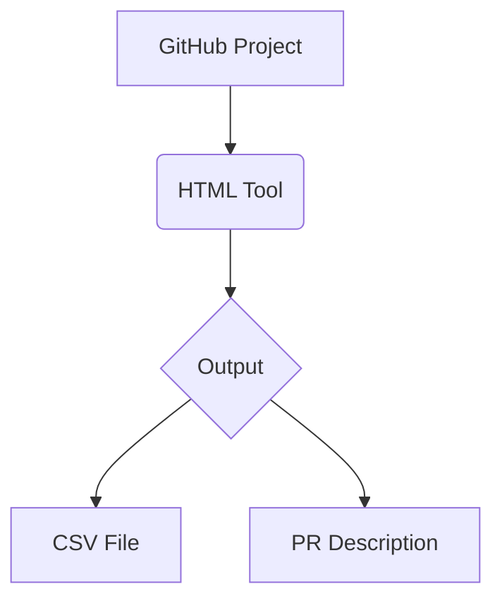

# 🛠️ BlocFort GitHub Toolkit  
  
*Deterministic tools for GitHub workflows: Board exports + PR templates—no black-box AI.*  

░▒▓█►◄█▓▒░  

## 🚀 Quick Start  
```bash
# Clone the repository
git clone https://github.com/blocfort/gh-boardtools.git
cd gh-boardtools

# Run tools directly in browser:
open tools/pr-generator.html   # PR Builder
open tools/board-exporter.html # Board → CSV
```

## 🔥 BlocFort Edge  
### 🧩 Core Features  
| Tool               | Description                          |  
|--------------------|--------------------------------------|  
| **PR Generator**   | Rule-based pull request templates    |  
| **Board Exporter** | GitHub Projects → Excel/CSV         |  
| **Hybrid Engine**  | HTML forms → platform-specific code |  

```diff
+ 100% client-side (no server needed)
+ Works offline after download
+ Orange-branded UI (#f97316 accents)
```

### 💎 Advanced Use  
<details>
<summary>✨ Template Customization</summary>
1. **Save Your Presets**  
```javascript
// Save to browser storage
localStorage.setItem('blocfort_pr_template', JSON.stringify(myTemplate));
```
2. **Keyboard Shortcuts**  
- `Ctrl+Shift+P`: Generate PR  
- `Ctrl+Shift+E`: Export Board  
3. **Debug Mode**  
```bash
open tools/pr-generator.html?debug=1
```
</details>

░▒▓█►◄█▓▒░  

## 🖼️ How It Works  
  


## 📋 Usage Examples  
### 1. PR Generator  
```html
<!-- Input Form -->
<textarea id="changes">Fixed auth timeout</textarea>
<button onclick="generatePR()">Submit</button>

<!-- Output -->
## Changes
Fixed auth timeout
```
### 2. Board Exporter  
```javascript
// Output CSV Example:
"Title","Status","Last Updated"
"Fix login bug","In Progress","2023-11-20"
```

## 🧰 Tech Stack  
| Component       | Implementation           |  
|-----------------|--------------------------|  
| Core            | Vanilla JS + HTML5       |  
| Styling         | CSS3 variables          |  
| Export Engine   | SheetJS (Apache 2.0)    |  

░▒▓█►◄█▓▒░  

## 📜 License  
MIT License - [View ./LICENSE](./LICENSE)  

<sub>📦 Size: 412KB | 🔄 Updated: ${new Date().toISOString().split('T')[0]}</sub>
